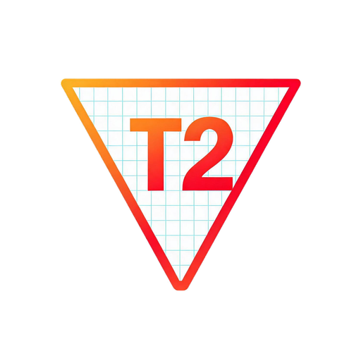
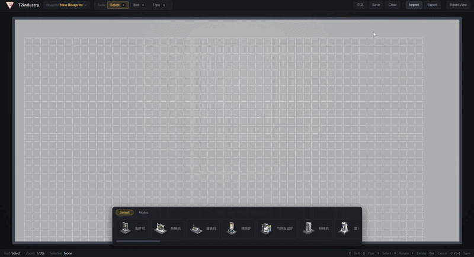

# T2industry Game Blueprint Editor

<p align="center">
  
</p>

An in-browser blueprint / factory layout editor for **Arknights: Endfield**, built with Vue 3 and PIXI.js. It lets you place machines, belts and pipes on a canvas grid, switch between blueprints, and configure machine recipes and port icons — all running entirely in the browser.

> **中文版本请见 [README.zh-CN.md](README.zh-CN.md)**

## Demo

<p align="center">
  
</p>

## Features

- **Blueprint management** — create, switch, and delete blueprints; import/export as files; persisted locally in the browser
- **Canvas stage** — grid-based placement with zoom / pan / reset view (PIXI.js rendering)
- **Machine palette** — bottom floating bar with machines (grouped by `category`, currently all under "Default") and nodes (belt / pipe splitters, merges, crosses)
- **Recipe selection** — click a machine to open a recipe modal; pick from available recipes and see the current input/output items
- **Port icon configuration** — configure output port icons per machine type (`po1/po2`, `bo1–bo6`, `pi1`, …), with a per-port candidate list and a clear (empty) option
- **Keyboard shortcuts** — `X` select, `E` belt, `Q` pipe, `R` rotate, `F` delete, `Esc` cancel, `Ctrl+S` save
- **i18n** — Simplified Chinese and English, switchable from the top bar; language choice is persisted

## Tech Stack

- [Vue 3](https://vuejs.org/) (`<script setup>`) + [Vite](https://vitejs.dev/)
- [Pinia](https://pinia.vuejs.org/) with persisted state
- [PIXI.js](https://pixijs.com/) 8.x for canvas rendering
- [vue-i18n](https://vue-i18n.intlify.dev/) for internationalization

## Getting Started

```bash
# install dependencies
npm install

# start the dev server
npm run dev

# production build
npm run build

# preview the production build
npm run preview
```

The engine and the UI are decoupled: all UI components communicate with the engine only through the facade at `src/engine/plugin/api.js`; the `engine/` directory contains the PIXI canvas engine and should not be modified from the UI layer.

## Project Structure (summary)

```
src/
├── components/
│   ├── SimCanvas.vue          # PIXI stage mount
│   └── editor/
│       ├── EditorShell.vue    # layout & UI↔engine bridge
│       ├── TopBar.vue         # top toolbar, blueprints, tools, language
│       ├── PlaceBar.vue       # bottom floating machine/node palette
│       ├── RecipeModal.vue    # recipe & port-icon configuration
│       ├── SpriteIcon.vue     # icons.webp sprite-sheet icons
│       └── StatusBar.vue      # status bar
├── engine/                    # PIXI canvas engine (decoupled)
├── i18n/                      # vue-i18n setup + locale files
├── stores/                    # UI state
└── main.js
public/
├── configs/                   # machines.json / data.json / recipes…
└── resources/                 # textures, icons.webp, machine_icons…
```

## Internationalization

- Locale files: `src/i18n/locales/zh-CN.js` and `src/i18n/locales/en-US.js`
- Default language: **Chinese (Simplified)**; switch to English via the `EN / 中文` button in the top bar
- The selection is persisted in `localStorage`

## Disclaimer

This project is an **unofficial, fan-made** tool. It is **not affiliated with, endorsed by, or connected to** Hypergryph or any of its subsidiaries.

- *Arknights: Endfield* and all related game assets (graphics, icons, names, configurations) are the property of their respective owners.
- Game data used by this project is provided for study and reference only; it may be changed or removed at any time.
- This project is for **personal / educational use** and is **not for commercial distribution**.
- If you believe any content infringes your rights, please contact the maintainer and it will be handled promptly.
